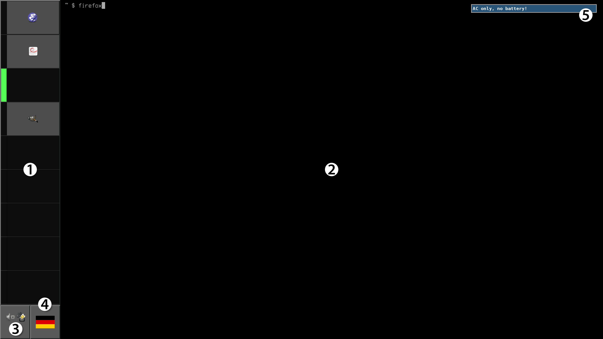
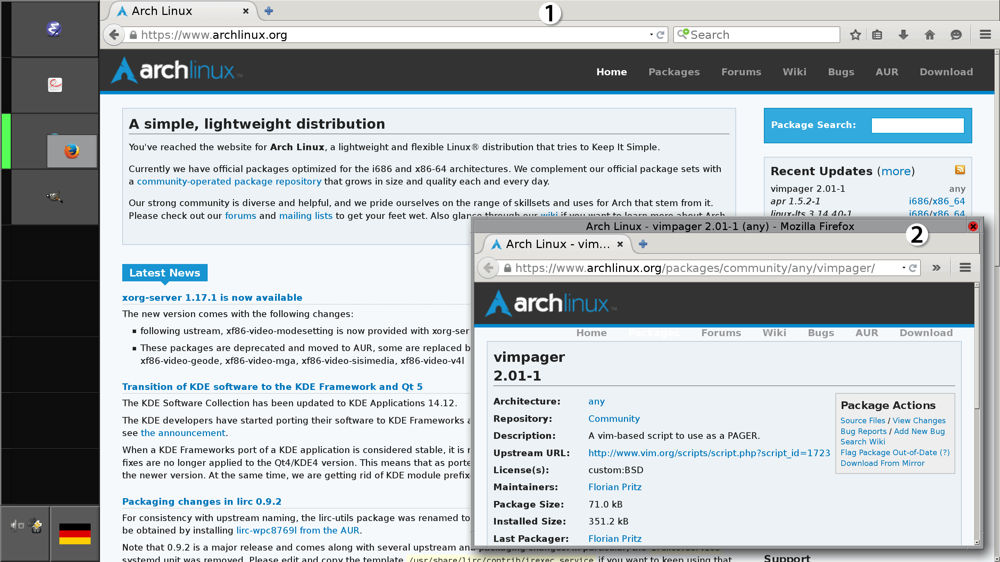

Introduction
============

*hiwiwi* is a custom desktop environment made for use on a
[ThinkPad T550 20CJS01P00][1] with Arch Linux.

Concept:

  * System is controlled via the command line.

  * Easy to grasp UI, clearly laid out: Everything is visible all the time in a
    classic windowing system.

  * Good visibility on a high DPI screen: 2880×1620 px at 192 DPI

    Note that the actual resultion of the screen at 213 DPI is higher. However,
    just doubling 96 DPI has been [reported][3] to give crisper font rendering
    results, and possibly it make GUIs designed for 96 DPI look better.

  * Vertical screen real estate is for content.

It may be interesting to make the system adapt to different screen resolutions.

Screenshots
===========

Pristine desktop
----------------

 1. Virtual desktops with current desktop highlighted in green. (FvwmPager)

 2. Shell on each desktop, on the lowest layer. (urxvt)

 3. Tray icons. (Stalonetray)

 4. Keyboard layout switcher. (xxkb)

 5. Notifications. (dunst)

Populated desktop
-----------------

 1. The first application window opens without decorations, taking up available
    space. (FVWM)

 2. Additional application windows open on a layer above. Windows can only be
    resized and closed, not maximized nor iconified. Shadow rendered by
    compositor. (compton)

Installation
============

Steps:

 1. Clone to: `~/.hiwiwi`

 2. Link dot files to their respective places below `$HOME`, or include them
    from other files.

 3. Install dependencies. Look in `.xinitrc`. Concerning compatibility of
    software, consider the age of the last modification / commit.

Known issues
============

  * Emacs 24.5.1 doesn’t play well with GDK scaling, set in `.xinitrc`. To get
    a usable scrollbar, see the [workaround][2] posted on 2015-04-26 WEST in
    the Arch Linux Forums.

Coding conventions
==================

  * Maximum line length (where enforceable): 80 characters

  * Comments in Markdown.

Example test environment
========================

Create a desktop for testing using VNC:

    $ vncserver :0 -geometry 2880x1620 -dpi 192 -fg -xstartup ~/.xinitrc

Use [x11vnc][4] to scale down the desktop for viewing it on a lower resolution
screen:

    $ x11vnc -scale 1/2 -display :0 -rfbport 5901

License
=======

Except where noted otherwise, files are licensed under the WTFPL.

Copyright © 2015–17 [Felix E. Klee](felix.klee@inka.de)

This work is free. You can redistribute it and/or modify it under the terms of
the Do What The Fuck You Want To Public License, Version 2, as published by Sam
Hocevar. See the COPYING file for more details.

[1]: http://support.lenovo.com/us/en/products/laptops-and-netbooks/thinkpad-t-series-laptops/thinkpad-t550/20cj/s01p00
[2]: https://bbs.archlinux.org/viewtopic.php?pid=1523352#p1523352
[3]: https://wiki.archlinux.org/index.php?title=HiDPI&oldid=373328#X_Server
[4]: http://www.karlrunge.com/x11vnc/
